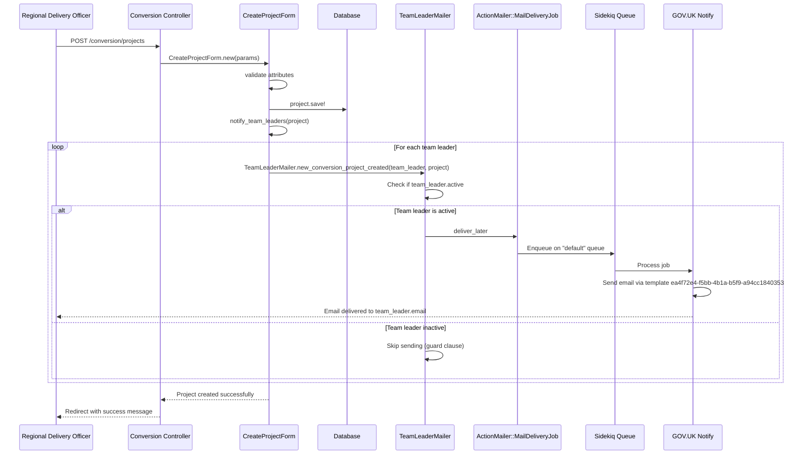

# Email Flows Documentation

## Overview

This document traces the complete flow of each automated email from trigger event to delivery, with detailed code paths and sequence diagrams.

## Example Template Flow (From Screenshot)

The screenshot shows the "You have a new project to assign" email, which corresponds to `TeamLeaderMailer#new_conversion_project_created`.

### Complete Flow Sequence Diagram



## Detailed Email Flows

### 1. UserAccountMailer#new_account_added

**Trigger**: Service support creates new user account

**Flow**:
1. **HTTP Request**: `POST /service_support/users` (`app/controllers/service_support/users_controller.rb:22-34`)
2. **Controller Action**: `ServiceSupport::UsersController#create`
3. **User Creation**: `@user.save` (line 28)
4. **Email Trigger**: `send_new_account_email(@user)` (line 29)
5. **Mailer Call**: `UserAccountMailer.new_account_added(user).deliver_later` (line 101)
6. **Job Enqueue**: `ActionMailer::MailDeliveryJob` enqueued on `"default"` queue
7. **Delivery**: GOV.UK Notify processes job and sends email using template `d55de8f1-ce5a-4498-8229-baac7c0ee45f`

**Code Path**:
```
app/controllers/service_support/users_controller.rb:22-34
├── app/controllers/service_support/users_controller.rb:100-102 (send_new_account_email)
├── app/mailers/user_account_mailer.rb:2-10 (new_account_added)
└── ActionMailer::MailDeliveryJob → GOV.UK Notify
```

### 2. TeamLeaderMailer#new_conversion_project_created

**Trigger**: Conversion project created/assigned to regional caseworker team

**Flow**:
1. **HTTP Request**: `POST /conversion/projects` or project handover
2. **Form Processing**: `Conversion::CreateProjectForm#save` or `EditProjectForm#save`
3. **Condition Check**: `if assigned_to_regional_caseworker_team` (line 79 in create form)
4. **Team Leader Iteration**: `User.team_leaders.each do |team_leader|`
5. **Active Check**: `if team_leader.active` (guard clause)
6. **Mailer Call**: `TeamLeaderMailer.new_conversion_project_created(team_leader, project).deliver_later`
7. **Job Enqueue**: `ActionMailer::MailDeliveryJob` enqueued on `"default"` queue
8. **Delivery**: GOV.UK Notify processes job and sends email using template `ea4f72e4-f5bb-4b1a-b5f9-a94cc1840353`

**Code Paths**:
```
# Path 1: Project Creation
app/controllers/conversion/projects_controller.rb (implied)
├── app/forms/conversion/create_project_form.rb:29-32 (notify_team_leaders)
├── app/forms/conversion/create_project_form.rb:79 (conditional call)
└── app/mailers/team_leader_mailer.rb:2-11

# Path 2: Project Handover
app/controllers/all/handover/handovers_controller.rb:27-45
├── app/controllers/all/handover/handovers_controller.rb:81-84 (notify_team_leaders)
└── app/mailers/team_leader_mailer.rb:2-11

# Path 3: Project Edit
app/forms/edit_project_form.rb:38-41 (notify_team_leaders)
└── app/mailers/team_leader_mailer.rb:2-11
```

### 3. TeamLeaderMailer#new_transfer_project_created

**Trigger**: Transfer project created/assigned to regional caseworker team

**Flow**:
1. **HTTP Request**: `POST /transfer/projects`
2. **Form Processing**: `Transfer::CreateProjectForm#save`
3. **Condition Check**: `if assigned_to_regional_caseworker_team` (line 80)
4. **Team Leader Iteration**: `User.team_leaders.each do |team_leader|`
5. **Active Check**: `if team_leader.active` (guard clause)
6. **Mailer Call**: `TeamLeaderMailer.new_transfer_project_created(team_leader, project).deliver_later`
7. **Job Enqueue**: `ActionMailer::MailDeliveryJob` enqueued on `"default"` queue
8. **Delivery**: GOV.UK Notify processes job and sends email using template `b0df8e28-ea23-46c5-9a83-82abc6b29193`

**Code Path**:
```
app/controllers/transfer/projects_controller.rb (implied)
├── app/forms/transfer/create_project_form.rb:86-89 (notify_team_leaders)
├── app/forms/transfer/create_project_form.rb:80 (conditional call)
└── app/mailers/team_leader_mailer.rb:13-22
```

### 4. AssignedToMailer#assigned_notification

**Trigger**: Project assigned to specific caseworker

**Flow**:
1. **HTTP Request**: `POST /internal_contacts/:project_id/assigned_user` (implied)
2. **Form Processing**: `InternalContacts::EditAssignedUserForm#update`
3. **Project Update**: `project.update(assigned_to: user)` (line 27)
4. **Email Trigger**: `send_assigned_email` (line 28)
5. **Active Check**: `if user.active` (guard clause)
6. **Mailer Call**: `AssignedToMailer.assigned_notification(user, @project).deliver_later`
7. **Job Enqueue**: `ActionMailer::MailDeliveryJob` enqueued on `"default"` queue
8. **Delivery**: GOV.UK Notify processes job and sends email using template `ec6823ec-0aae-439b-b2f9-c626809b7c61`

**Code Path**:
```
app/controllers/internal_contacts_controller.rb (implied)
├── app/forms/internal_contacts/edit_assigned_user_form.rb:25-34 (update)
├── app/forms/internal_contacts/edit_assigned_user_form.rb:42-44 (send_assigned_email)
└── app/mailers/assigned_to_mailer.rb:2-11
```

## Key Flow Components

### ApplicationMailer Base Class
All mailers inherit from `ApplicationMailer < Mail::Notify::Mailer` (`app/mailers/application_mailer.rb:1`):
- Provides `url_to_project(project)` helper method
- Uses GOV.UK Notify delivery method
- Handles template mail generation

### User Scopes and Guards
- **Team Leaders**: `User.team_leaders` scope (`app/models/user.rb:14`)
- **Active Users**: `user.active` method (`app/models/user.rb:58-60`)
- **Assignable Users**: `User.assignable` scope (`app/models/user.rb:23`)

### Job Processing
- **Queue**: All emails use `"default"` queue
- **Job Class**: `ActionMailer::MailDeliveryJob`
- **Processing**: Sidekiq in production, test adapter in test environment

### GOV.UK Notify Integration
- **Template Method**: `template_mail(template_id, options)`
- **Personalization**: Variables passed in `personalisation` hash
- **Delivery**: Handled by mail-notify gem

## Error Handling and Guards

### Silent Failures
Emails can fail silently due to:
1. **Inactive Users**: `if team_leader.active` / `if user.active` guards
2. **Missing Recipients**: Empty `User.team_leaders` or `User.assignable` scopes
3. **Conditional Logic**: `if assigned_to_regional_caseworker_team` conditions
4. **Queue Failures**: Sidekiq not running or Redis connection issues

### No Explicit Error Handling
No `rescue` blocks found around email sending, so errors would bubble up unless caught by:
- Application-level error handling
- Sidekiq retry mechanisms
- GOV.UK Notify API error responses

## Testing Coverage

All email flows have corresponding test coverage:
- `spec/mailers/user_account_mailer_spec.rb`
- `spec/mailers/team_leader_mailer_spec.rb`
- `spec/mailers/assigned_to_mailer_spec.rb`
- Integration tests in form and controller specs

Tests verify:
- Correct template IDs
- Proper personalization variables
- Job enqueueing behavior
- Guard clause behavior (inactive users)
